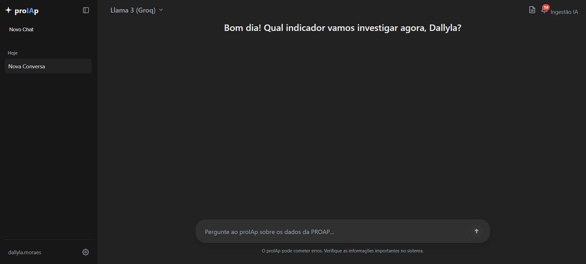
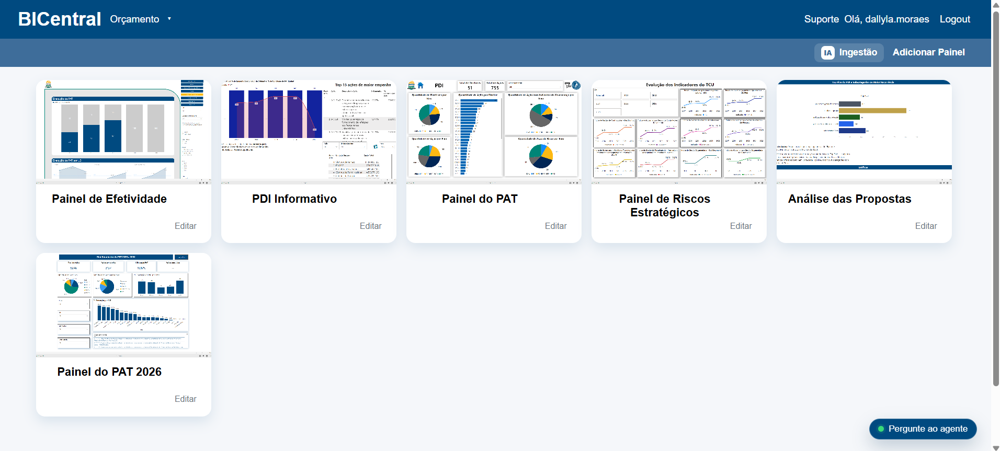

<div align="center">


### Hub de painéis Power BI e agente de IA institucional para a PROAP/UFT

[](backend)
[](frontend)
[](backend)
[](https://supabase.com)

</div>

---

## O que é o BICentral

O BICentral é a plataforma interna da PROAP (Pró-Reitoria de Avaliação e Planejamento) da UFT para centralizar painéis Power BI e dar acesso rápido, conversacional, aos dados do PAT (Plano Anual de Trabalho) e do PDI (Plano de Desenvolvimento Institucional) — sem precisar garimpar planilha.

O projeto nasceu como hub de painéis e cresceu para incluir o **proIAp**, o agente de IA que é hoje o coração do sistema.

## proIAp — o agente

O proIAp responde perguntas sobre o PAT/PDI combinando duas fontes:

- **Consulta estruturada** — ferramentas que consultam o banco direto (tarefas do usuário logado, ranking de execução por departamento, relatórios de desempenho), sempre com números reais, nunca inventados.
- **Busca semântica (RAG)** — sobre documentos institucionais enviados pela equipe (PDFs, planilhas, normativas), disponível para administradores.

Ele também gera relatórios de desempenho em DOCX/PDF sob demanda e mantém um painel de notificações de atraso por departamento.

## Funcionalidades

- 📊 **Painéis Power BI** — cadastro, edição e captura automática de capa por usuário.
- 🤖 **proIAp** — chat com o agente, tarefas pessoais, ranking de departamentos, relatórios automáticos.
- 🔔 **Notificações** — alertas de rendimento e atraso por departamento, com painel detalhado.
- 🛡️ **Painel admin** — gestão de equipes, gerentes, responsáveis e ingestão de documentos para o RAG.
- 🔐 **Autenticação** — cadastro/login com JWT e verificação de e-mail.

## Screenshots

<div align="center">


</div>

## Tecnologias

**Backend**: Spring Boot 3.4, Java 17, Spring Security (JWT), langchain4j (Groq/Gemini/Cerebras/SambaNova/Ollama), Postgres via Supabase, JdbcTemplate.

**Frontend**: Angular 20, standalone components.

## Equipe

Desenvolvido por estagiários da PROAP, estudantes de Ciência da Computação da UFT:

- **Dallyla de Moraes Sousa** 
- **Lean de Albuquerque Pereira**
- **Neci Mendes Fialho**

## Como rodar localmente

Backend:
```bash
cd backend
./mvnw spring-boot:run
```

Frontend:
```bash
cd frontend
npm install
npm start
```

## Estrutura

- `backend/` — API e serviços: autenticação, painéis, proIAp (agentes de IA, tools, RAG), admin, notificações, ranking.
- `frontend/` — UI Angular: login, cadastro, home, chat do proIAp, painel admin.
- `docs/` — documentação complementar.

## Observações

- O link do Power BI precisa começar com `https://app.powerbi.com/view?r=`.
- A captura da capa dos painéis roda de forma assíncrona para não travar o cadastro.
