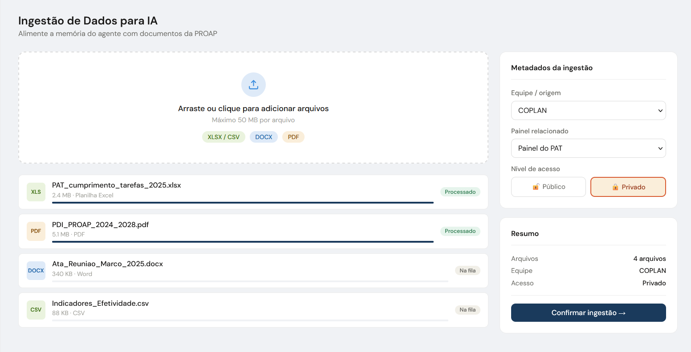

# Sprint 1 - Neci

## Minha parte

Criar a tela de ingestao de documentos para o Agente de IA.

## Atencao Importante

Nao substituir a funcionalidade que ja existe de **Adicionar Painel**, onde o usuario informa o link do Power BI.

Essa funcionalidade de paineis continua existindo do jeito atual.

A tela de ingestao para IA deve ser uma nova entrada dentro do BICentral, por exemplo um botao separado como:

`Ingestao para IA`

Esse botao deve abrir a tela de envio de documentos para alimentar o agente.

Resumo:

- Adicionar Painel: continua servindo para cadastrar link de Power BI.
- Ingestao para IA: nova funcionalidade para enviar documentos usados pelo agente.
- Uma coisa nao deve substituir a outra.

## Referencia visual

Usar como base a imagem de referencia enviada na conversa:



Essa imagem serve como direcao visual para organizacao da tela: area principal grande, painel lateral com metadados e resumo, botoes claros e estados de processamento.

Importante: remover o campo **Painel relacionado**. Esse campo nao sera usado agora.

Na tela de ingestao do agente, manter apenas o que faz sentido para enviar documentos para a IA:

- Upload de documentos.
- Equipe/origem.
- Nivel de acesso do documento: `PUBLICO` ou `PRIVADO`.
- Resumo dos arquivos/documentos.
- Botao principal de confirmar ingestao.

## Em que pe esta o agente hoje

O projeto ja tem a parte de ingestao implementada no backend.

Ja existe:

- Extracao de texto de PDF.
- Extracao de texto de Excel `.xlsx`.
- Limpeza do texto.
- Chunking/fatiamento do texto.
- Criacao de chunks com metadados.
- Endpoint de teste para gerar preview da ingestao em JSON.

Onde esta no codigo:

- `backend/src/main/java/com/bicentral/bicentral_backend/service/IngestaoService.java`
- `backend/src/main/java/com/bicentral/bicentral_backend/dto/ChunkDTO.java`
- `backend/src/main/java/com/bicentral/bicentral_backend/controller/AiTestController.java`

O que ainda falta para o agente:

- Tela de ingestao conectada ao backend.
- Endpoint oficial do agente.
- Embeddings.
- Supabase Vector.
- Busca semantica.
- Resposta final usando Gemini com os chunks encontrados.

Importante:

- Documento publico: pode ser consultado por qualquer usuario autenticado.
- Documento privado: so pode ser consultado por usuarios/equipes autorizadas.
- Quem decide isso e o backend/IA na hora da busca. A tela nao deve deixar o usuario escolher se quer buscar em documento publico ou privado.
- Nesta tela, o usuario escolhe a visibilidade do documento no momento da ingestao: `PUBLICO` ou `PRIVADO`.
- Depois, quando o chat existir, o usuario nao escolhe publico/privado na pergunta. O sistema aplica a permissao sozinho.

## O que eu preciso fazer agora

- Criar a tela de ingestao de documentos para IA.
- Criar area de upload de arquivos.
- Permitir selecionar equipe/origem.
- Permitir selecionar o nivel de acesso do documento:
  - `PUBLICO`;
  - `PRIVADO`.
- Remover o campo **Painel relacionado**.
- Mostrar lista dos arquivos selecionados.
- Mostrar status de processamento:
  - aguardando;
  - processando;
  - processado;
  - erro.
- Criar botao para confirmar ingestao.
- Conectar a tela ao endpoint de ingestao que o Lean criar.

Endpoint esperado:

`POST /api/ia/ingestao`

## O que eu preciso entregar no fim da sprint

- Tela de ingestao funcionando visualmente.
- Usuario consegue selecionar arquivos.
- Usuario consegue escolher equipe/origem.
- Usuario consegue escolher se o documento e `PUBLICO` ou `PRIVADO`.
- Usuario consegue confirmar a ingestao.
- Tela mostra processamento e erro quando acontecer.

## Posso comecar agora?

Sim. Pode comecar mesmo antes da IA estar pronta.

Enquanto a Dallyla termina embeddings/Supabase Vector, Lean pode criar um endpoint temporario para voce testar o envio da ingestao.

## Dependo de alguem?

Dependo do Lean criar o endpoint de ingestao:

`POST /api/ia/ingestao`

No inicio, esse endpoint pode retornar uma resposta simples so para testar o frontend.

## Exemplo do que a tela vai enviar

```text
arquivo: manual-uft.pdf
equipe: COMUNICACAO
visibilidade: PUBLICO
```

## Exemplo do que a tela vai receber

```json
{
  "mensagem": "Documento enviado para ingestao.",
  "status": "PROCESSANDO"
}
```

## Nao preciso mexer nisso agora

- Embeddings.
- Supabase Vector.
- Logica da IA.
- Tela de chat.
- Autenticacao.
- Regras de equipe.
